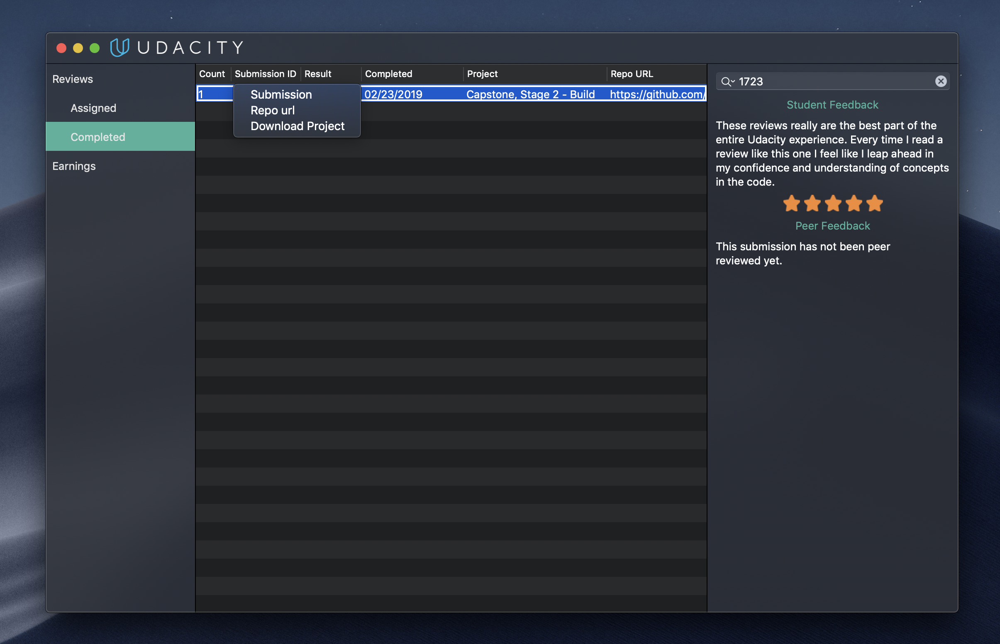

# Udacity Mentor Dashboard

[](https://github.com/dnKaratzas/udacity-mentor-dashboard/releases)


With Udacity Mentor Dashboard app, you can access easily your completed and assigned reviews.

## Installation

You can download an app build [on releases page](https://github.com/dnKaratzas/udacity-mentor-dashboard/releases).

### Requirements

- macOS 10.12+

### Build Requirements
- Xcode 10.0 and above
- Swift 5.0 and above

Before you can run the project, make sure to install the dependencies using [Carthage](https://github.com/Carthage/Carthage/releases).
You can install Carthage dependencies by running:
```
carthage update --platform macOS
````

## Features

- View completed and assigned reviews.
- Searching.
- Sorting.
- Double click to open submission on browser.
- Right click menu contains:
	- Open submission on browser.
	- Navigate to Github repository if exists.
	- Download project files.

## Screenshot



## Open Source Libraries

- [Alamofire](https://github.com/Alamofire/Alamofire)
- [SwiftyBeaver](https://github.com/SwiftyBeaver/SwiftyBeaver)
- [KeychainAccess](https://github.com/kishikawakatsumi/KeychainAccess)


## License

Copyright 2018 Dionysios Karatzas

Licensed under the Apache License, Version 2.0 (the "License"); you may not use this file except in compliance with the License. You may obtain a copy of the License at

```
http://www.apache.org/licenses/LICENSE-2.0
```

Unless required by applicable law or agreed to in writing, software distributed under the License is distributed on an "AS IS" BASIS, WITHOUT WARRANTIES OR CONDITIONS OF ANY KIND, either express or implied. See the License for the specific language governing permissions and limitations under the License.
